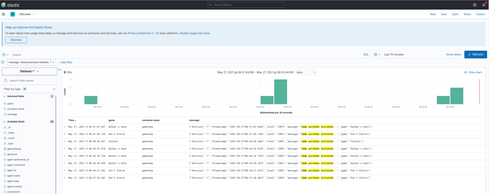

# GAME SHOP

## What's in here?
This is a basic CRUD api for managing the games inventory and shopping carts.

## How to run it?
You need a Linux machine (with sudo user) with Java11 and maven to run this project.
To build it from sources, run:
> ./mvnw clean install

To run only the gameshop service by building the project if you don't want to use any analytics functionalities,
using Java11 only, please go to the project root directory and run:
(note that only Swagger, Actuator and Prometheus endpoints will be available then):

> java -jar target/gameshop-0.0.1-SNAPSHOT.jar --spring.profiles.active=prd

This software uses docker-compose being able to deal with version 3.3 of the compose file.
To start the gameshop service alone in the Docker container, please run the command below:
> sudo docker-compose up -d --build gameshop

To be able to run filebeat and elasticsearch docker containers on your machine and use Kibana for further analytics, please run the command below
(if not - just skip these commands):
> sudo chown root compose-config/filebeat-config/filebeat.yml &&
> sudo chmod go-w compose-config/filebeat-config/filebeat.yml

> sudo chown -R 1000:1000 compose-config/elastic-data &&
> sudo sysctl -w vm.max_map_count=262144

To start the gameshop service and its monitoring-analytics services
(filebeat, elasticsearch and kibana), just  
go to the project root directory and run the following commands:
> sudo docker-compose up -d --build

afterwards the Kibana and Elasticsearch endpoints from Monitoring and analytics section should be available.

## Analytics
The project uses basic analytics functionality utilizing modified ELK Stack.
To be able to use it, please go to Kibana endpoint and from menu choose:

####Management -> StackManagement -> Kibana -> IndexPatterns
Click on Create index pattern.
Then create the index pattern matching existing filebeat index:

####filebeat-*
Following the instructions, define the timefields to be:

####@timestamp
and finish creating the index pattern.
Than in menu go to: 

####Analytics -> Discover
You may define your own searches or filter the log messages as you will.
For sake of this project, a simple "Game added" message has been created so that
the Service owner may see how many and which games have been added to cart.
Please visit the https://www.elastic.co/guide/en/kibana/current/get-started.html
for more guidance on Kibana usage.

## Endpoints 
* [Swagger](http://localhost:8080/swagger-ui.html)
  
  ### Monitoring and analytics
  
  * [Actuator](http://localhost:8080/actuator)
  * [Prometheus](http://localhost:8080/actuator/prometheus)
  * [Elasticsearch](http://localhost:9200)
  * [Kibana](http://localhost:5601)